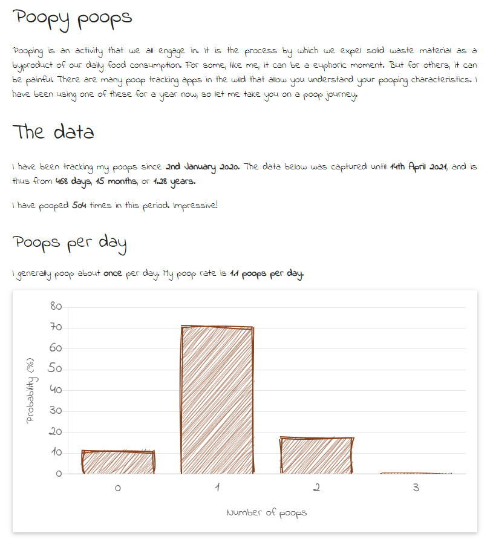

# Poop tracker to webpage

This repo hold code to take data from the [Poop Tracker app by Appstronaut Studios](https://play.google.com/store/apps/details?id=com.appstronautstudios.pooplog&hl=en_AU&gl=US), generate some data summaries using R, and then have those values plug into a single static webpage with various [chartJS](https://www.chartjs.org/) graphics.  

## Live example

My own data is hosted on <a href="http://sniel.id.au/poops" target="_blank">sniel.id.au</a>. 

## Data collection and export

Data is collected within the poop tracker app. This app has implicit collection of:

  1. Poop time and date  
  2. Stool type (following the 7 types in the Bristol Stool Chart)
  3. Stool size  
  4. Stool colour - not used here 
  5. Notes - This is free text, and in I've used it to track place
  
Data is exported from the Poop Tracker app to the `./raw-data` folder.

## Data analysis

The script `raw-data-to-json.R` uses R to generate a number of summaries. Briefly,
this includes:  

  1. Duration of data collection
  2. Total number of poops  
  3. Summaries by day, hour, size, shape and place  
  
These are stored in a list, which is then convert to a JSON file called `poop_data.json`, and
this is saved in trhe `./web/data` folder.

## Data presentation

The `./web` folder holds the necessary files for a static webpage presentation of the poop data.
It uses:

  1. A minified HTML5 boiler plate from [html5boilerplate.com](https://html5boilerplate.com/)
  2. The W3.CSS framework from [w3schools.com](https://www.w3schools.com/W3CSs/)  
  3. The [chartJS](https://www.chartjs.org/) JavaScript library with the [rough plugin](https://github.com/nagix/chartjs-plugin-rough) for that
  hand-drawn look
  4. "Indie Flower" cursive font from [fonts.google](https://fonts.google.com/specimen/Indie+Flower)
  5. Custom javascript code (`poops.js`) for plugging in values from the data analysis
  
`./web/index.html` acts as a template with placeholders for values and plots. The `poops.js` takes the `./web/data/poop_data.json` and inserts the values into the placeholders, as well as generates the plots.

The final version looks something like this:

